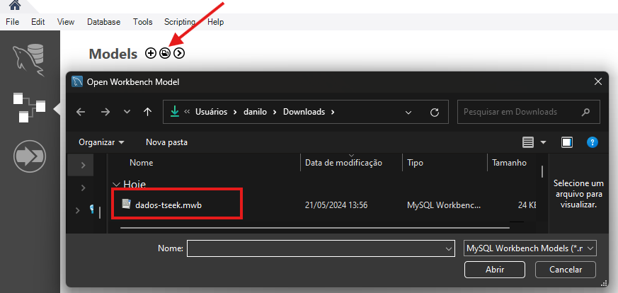
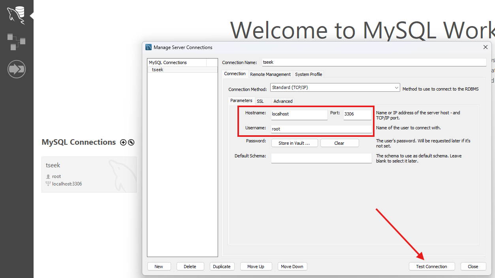
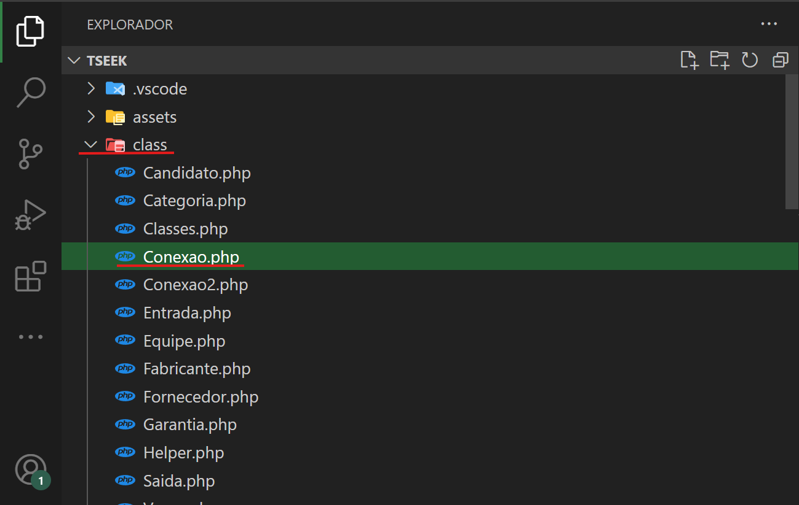
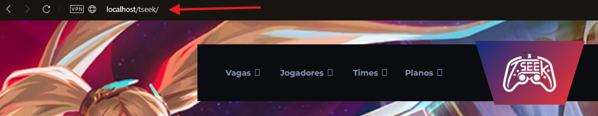

<h1>TseeK</h1>
<h3>Por quê do Projeto?</h3>
<ul>
    <li>O projeto foi concebido com o propósito de agilizar e simplificar o processo de contratação de jogadores no cenário dos jogos eletrônicos competitivos.</li>
    <li>A essência da plataforma TseeK é como uma versão Catho voltada para o cenário de E-Sports, conectando empresas e jogadores em um espaço dinâmico, onde as vagas são anunciadas e os talentos podem se apresentar às equipes em busca de oportunidades.</li>
</ul>
<h2> 🧑🏾‍💻 Como utilizar este projeto localmente? </h2>

<p>Faça um clone do repositório</p>

```
git clone https://github.com/TseekPIM/tseek.git
```
<h3>Logo em seguida realize a instalação dos seguintes softwares:</h3>
<p>Wampserver: https://wampserver.aviatechno.net </p>
<p> MySQL: https://www.mysql.com </p>
<p>Visual Studio Code: https://code.visualstudio.com </p>
<hr>
<h3>📂Banco de Dados</h3>
<p>Para o funcionamento do banco de dados entre no link e baixe a modelagem e SCRIPT https://drive.google.com/drive/folders/1g10eh8hiK0ikSpfILUxuo4B5msneJCvO?usp=sharing</p>
<br>
<p>Com o Wampserver iniciado entre no mySQL e a abra a modelagem do banco</p>

<p>Após abrir a modelagem, faça a exportação do script conforme a imagem abaixo:</p>

<p>Verifique se a conexão está estabelecida com o wampserver</p>

<p>Abra a pasta tseek com o VS code e encontre o arquivo conexao.php</p>

<p>Precisa estar da seguinte forma:</p>

```
        $db_host = 'localhost';// servidor
        $db_nome    = "tseek";    //nome do banco
        $db_usuario = 'root'; //usuario do banco
        $db_senha = '';
        $db_driver  = "mysql";
        $db_porta   = "3306";
```

<p>Logo após entre no gerenciador de arquivos WIN + E e encontre a pasta do repositório onde fez o clone em sua máquina, copie a pasta tseek e cole no seguinte caminho:</p>

```
C:\wamp64\www
```
<h3>Abra o navegador e digite o comando <b>localhost/tseek</b></h3>

<hr>
<h2>🛠️ Tecnologias utilizadas</h2>
<ul>
    <li>PHP</li>
    <li>Javascript</li>
    <li>Sass</li>
    <li>Css</li>
    <li>MySQL</li>
</ul>
