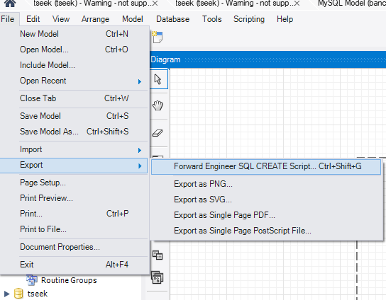
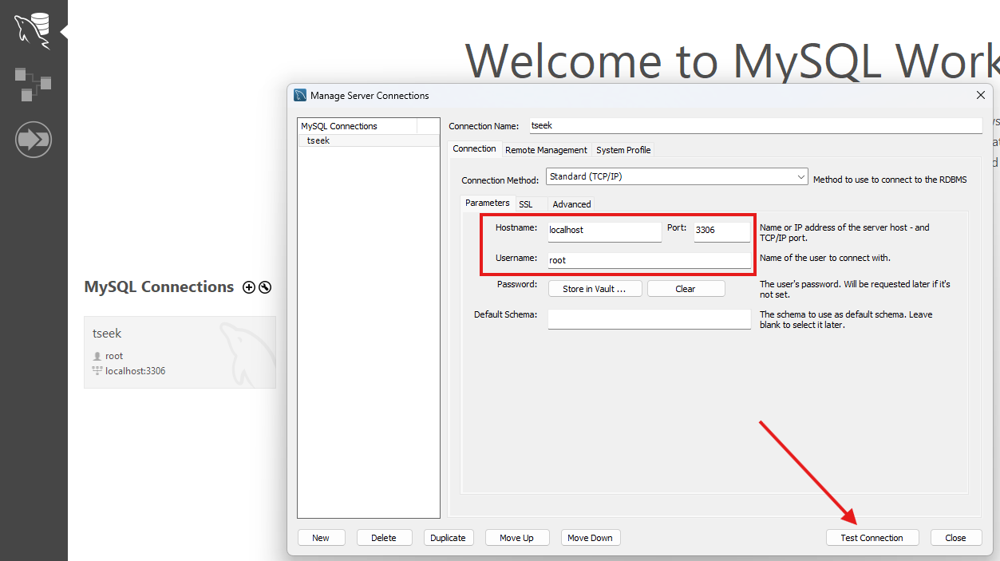
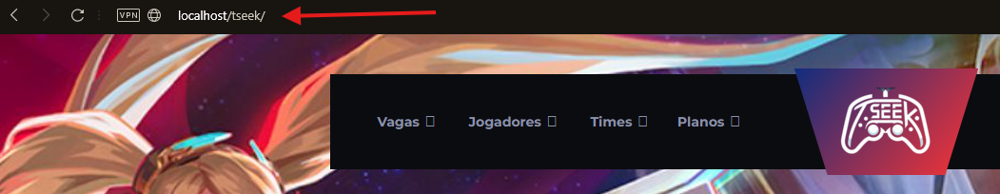

# TseeK

## Links Importantes
- [Site Oficial](https://tseek.com.br)
  
## Por que do Projeto?
- O projeto TseeK foi concebido com o propósito de agilizar e simplificar o processo de contratação de jogadores no cenário dos jogos eletrônicos competitivos.
- A plataforma TseeK é como uma versão do Catho voltada para o cenário de E-Sports, conectando empresas e jogadores em um espaço dinâmico, onde as vagas são anunciadas e os talentos podem se apresentar às equipes em busca de oportunidades.

## 🧑🏾‍💻 Como Utilizar Este Projeto Localmente?

### 1. Clonar o Repositório
Execute o seguinte comando para clonar o repositório:

```bash
git clone https://github.com/TseekPIM/tseek.git
```

### 2. Instalar Softwares Necess√°rios
Certifique-se de instalar os seguintes softwares:

- [Wampserver](https://wampserver.aviatechno.net)
- [MySQL](https://www.mysql.com)
- [Visual Studio Code](https://code.visualstudio.com)

### 3. Configurar o Banco de Dados
1. Baixe a modelagem e o script do banco de dados [aqui](https://drive.google.com/drive/folders/1g10eh8hiK0ikSpfILUxuo4B5msneJCvO?usp=sharing).
2. Inicie o Wampserver e abra o MySQL.
3. Importe a modelagem do banco:
   
4. Exporte o script conforme a imagem abaixo:
   
5. Verifique a conex√£o com o Wampserver:
   

### 4. Configurar Conex√£o com o Banco de Dados
1. Abra a pasta do projeto `tseek` no VS Code.
2. Encontre o arquivo `conexao.php` e certifique-se de que ele esteja configurado da seguinte forma:

```php
$db_host = 'localhost'; // servidor
$db_nome = 'tseek'; // nome do banco
$db_usuario = 'root'; // usu√°rio do banco
$db_senha = ''; // senha do banco
$db_driver = 'mysql'; // driver do banco
$db_porta = '3306'; // porta do banco
```

### 5. Configurar Diretório do Projeto
1. No gerenciador de arquivos (WIN + E), encontre a pasta do repositório clonado.
2. Copie a pasta `tseek` e cole no seguinte caminho:

```
C:\wamp64\www
```

### 6. Executar o Projeto
Abra o navegador e digite `localhost/tseek` para acessar o projeto.


## 🛠️ Tecnologias Utilizadas
- PHP
- JavaScript
- Sass
- CSS
- MySQL


